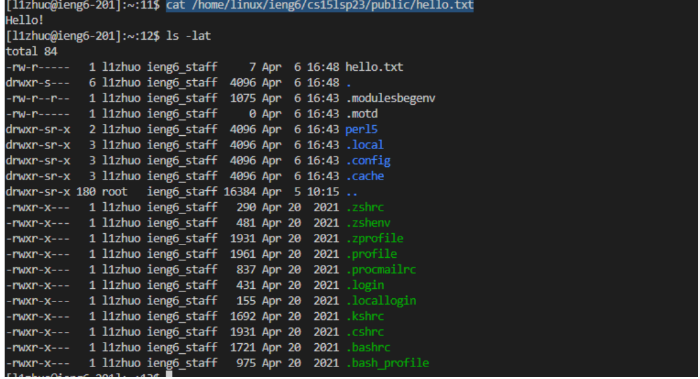

# **CSE15L Lab Report**
---
##1. Installing Visual Studio Code
  In order to correctly log into a course-specific account on ieng6, it is essential that you have Visual Studio code set up. 
  In this step, even though I didn't personally do it, but I have VScode already preinstalled not only on my laptop and PC, but also on the PCs in the lab room as well. However, if you don't have VScode pre-installed, you may navigate to the site [link](https://code.visualstudio.com/) to download the coding program after following the instruction on the website and installation application. 
  After having successfully downloaded VScode and installing it. Open it and you will see the welcoming screen similar to:
  
  You may start messing around by closing this page and clicking on the cross-sign. Hoewver, to remotely connect we first have to install Git in Visual studio code. 
---
##2. Remotely Connecting
  In this part, you have to download Git first if you are on Windows (which I am). In the lab, I tried to download Git and instaling it. However, installing it in the lab PC would require me using an adiminstrator account, which unfortunately my own CSE15L account couldn't provide, so I checked again in the PC and found out that Git is already pre-installed in the CSE lab computers. However, if you don't have Git, you would follow the link [Link](https://gitforwindows.org/) and download and install Git first for windows.
  After having Git installed, I then used the git bash to open the git-bash terminal instead of the default terminal in VScode. Specifically, follow the reddit post given in the lab instructions, ([Link](https://stackoverflow.com/a/50527994)), I was able to successfully open the git bash terminal. The instruction is as follows (summarized from the Reddit)  :
  1. Using Ctrl + ` key to open the terminal
  2. Open the command palette using Ctrl + Shift + P ( there will be like a search bar popped out on the top of the VSCode
  3. Type - and select Default Profile
  4. Select Git Bash from the options
  5. click the + icon in the terminal window which will now be a Git Bash terminal.
  
  Now we can start entering code to remotely connect to the ieng6. 
  First enterning the command `ssh cs15lsp23zz@ieng6.ucsd.edu`  and replace zz with your own course         specific account. So mine was `ssh cs15lsp23nh@ieng6.ucsd.edu`
  Then, the terminal will prompt the text: 
  ```
  The authenticity of host 'ieng6.ucsd.edu (128.54.70.227)' can't be established.
  RSA key fingerprint is SHA256:ksruYwhnYH+sySHnHAtLUHngrPEyZTDl/1x99wUQcec.
  Are you sure you want to continue connecting (yes/no/[fingerprint])? 
  ```
  After having typed `yes` to the block, the terminal will prompt the text `Password:` for you to type your password. Note that when you are typing your password, you can't see your text. This is not a bug or the program is frozen, (which was what I thought), but it's a password-protecting mechanism that the terminal adapts.
  After having the password entered in. there were some errors. Specifically with my own CSE15L account. That is to say, it looked like there were issues with CSE15L account and remote connection using lab PCs. My groupmates and me saw that after having putting in the password, our connection was immediately closed by the remote host, with text like 
  ```
  Connection to ieng6.ucsd.edu closed by remote host.
  Connection to ieng6.ucsd.edu closed.
  ```
  Therefore, we tried using our own school account, the main account where you have your first name and last name as the user name (e.g. mine was l1zhuo), and your own password.
  We follow the same process, but now typing in `ssh l1zhuo@ieng6.ucsd.edu` instead of `ssh cs15lsp23nh@ieng6.ucsd.edu`. and after enterning the paassword as usually, I was able to log on to ieng6. It looked like the image below:
  
  We are now remotely connected to ieng6. 
  
##3. Trying some commands.
  This part is fairly simple, I ran some command given in the lab instruction to test out.
  I tried all the command.
  `ls` meant listing the current working directory
  I chose `cat /home/linux/ieng6/cs15lsp23/public/hello.txt` and 'ls -lat'
  
