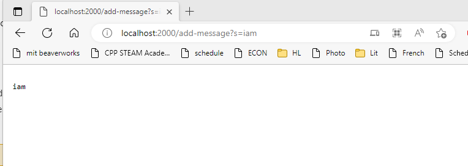
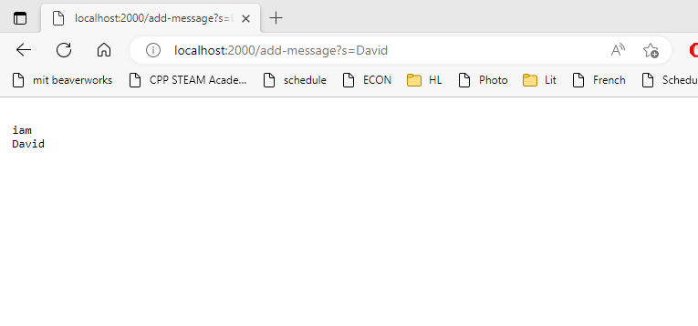
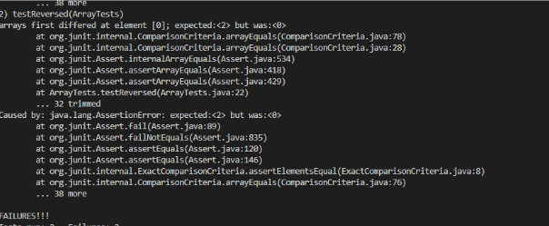

# **CSE15L Lab Report 2**

---

## Part 1

**Code for my StringSever**

---

```

#Code
import java.io.IOException;
import java.net.URI;
import java.util.*;

class StringHandler implements URLHandler{
    ArrayList<String> stringList = new ArrayList<>();
    
    public String handleRequest(URI url) {
        if (url.getPath().equals("/")) {
            String wholeList = "";
            for(String s: stringList){
                wholeList +="\n "+s;
            }
            return wholeList; 
        } else if (url.getPath().equals("/add-message")) {
            String[] parameters = url.getQuery().split("=");
            String wholeList = "";
            if (parameters[0].equals("s")) {
                stringList.add(parameters[1]);
                for(String s: stringList){
                    wholeList +="\n "+s;
                }
                return wholeList;
            }
            return "need a string to add";
        } else {
            return "404 Not Found!";
        }
    }
}
public class StringServer {
    public static void main(String[] args) throws IOException {
        if(args.length == 0){
            System.out.println("Missing port number! Try any number between 1024 to 49151");
            return;
        }

        int port = Integer.parseInt(args[0]);

        Server.start(port, new StringHandler());
    }
}
```

**Screen shot of adding in the first string**
---

---

In the first screen shot, we are trying to add in the string `"iam"` to the `string arraylist` in the local server. However, before everything heppens, the server was started by calling the `start()` method from the `Server` class and assigning the `int` value of `2000` to the server port from the command line, and creating a new `StringHandler` object. 


Then the `StringHandler` class creates an `String ArrayList` called `stringList` to store all string passed from user when they try to add `String` through entering URL. 


When we try to add in the `"iam"` string by passing a new `URI` value of `"http://localhost:2000/add-message?s=iam"`, this `URI` is passed to the server, and handled with the `StringHandler` class, which is a class that implements `URLHandler`. In the `StringHandler` class, the `handleRequest` method is called from the `Sever` class by its `handler`, which is the same `StringHandler` that we created when we start the server. The `HttpExchange` variable captures the `URI` value that we passes in when we enter the `URI`, and passes to the `handleRequest` method.


In the `handleRequest` method, the `if` statment was ran, it first gets the `path` from the `URI` by calling the `URI` class's method of `.getPath()`, then it compares first with just a `/`. This is to say that if no additional `path` was made by the user and in my code, I will just let the `handleRequest` return a `String` of already existed `String` in the `stringList` `string arraylist`. 


However, in our case, we do give the `path` of `/add-message`, thus, the `URI.getPath()` return the value of `/add-message`. It compares the `path` that we provided with `/add-message` and found it to be equal, which makes it move to the next step.


In the next step, a `String Array` called `parameters` is created to capture the user entered value by storing the `query` from `URI`into the array in a ordered way. Follow to the next line, an empty `String` called `wholeList` is created as the future returning `String` that will print the whole value in the `string ArrayList`.


First, the method calls the `.getQuery()` from the `URI` object, which returns things after the`?` sign and before the anchor in a `URI`, which is `"s=iam"`. It then calls the `.split(String regex)` method from the `String` class to disregard the `=` sign from `queries`. (the syntax of `split(String regex)` is to splitthe string with the dlimitator `regex`) Since all `query` follows the format of **?operation=keyword**, the splitting of the equal sign will allow the `parameters` to capture what operation is performed and what keywords is inserted into the `query`. Specifically, the splitting of the `"s=iam"` query, will create an `array` that takes in each after split `String` orderly. We assign this to the `parameter` array and the array now has the value of `{"s","iam"}`. 


Then we enter the `if` statment, and we check if the operation that we want to perform using the `URI` is indded the same syntax as the adding a new string operation, which is `"s=stringwewant"`. So it access `parameter`'s first element and see if it's an `"s"`. In this case, it is, then the method knows it's safe to append a `String` to the list of `String` in the `ArrayList stringList`. So, the line `stringList.add(parameters[1]);` is called, and `stringList` now has the `String` that we want to add, which is `iam`, which is also stored in the index `1` of the `parameters` array. 


After appending the `String` to the `ArrayList`, we want to print out every value. In my code, I did a `for each` loop to add the `String` to the `wholeList String`, which will return the ending `String`, formatted as each `String` is separated with the line break, `\n`. In this case, after the `for each` loop is ended, the `wholeList String` is stored with `"\n iam"`. This is then returned, which gets printed out on the webpage. 


In the end, the value of each member variable in the StringSever class is as follows:
```
ArrayList<String> stringList = {"iam"};
```
All other local variables are destroyed when the `handleRequest()` method finished, even though their field variables stay alive in the heap.


**Screen shot of adding in the second string**
---

---

Adding in the String `"David"` is similar to the first part.


First, `handleRequest(URI url)` is called, and the `URI` passed in from the `exchange` variable in the `Sever` class is `"http://localhost:2000/add-message?s=David"`.


The `if` statment was ran, calling the `url.getPath()`, the `path` returned is `/add-message`, which is equal to the second part of the `if` statment, we go on with the adding string part of the method.


`String[] parameters` is created and itialized through splitting the `query` we get from calling `url.getQuery()`, which is `"s=David"`. After splliting and assignign to a new array, the `parameter` now has the value of `{"s","David"}`. `String wholeList` is also created as the empty string, this will be the returning `String` after it has properly initalized later with all `String` in the `ArrayList<String> stringList`.


The if statment was ran to check the syntax, and to no surprise, the syntax is correct. `Parameter`'s first value is `"s"`, and then we want to append the `String` value passed in to the `stringList`. `"David"` is now appended, and the `for each` loop is ran again to adding in the `String` with linebreaks to the `whoeList`.


At the end `wholeList` has the value of `"\n iam\n David"`, and it's returned.


In the end, the value of each member variable in the StringSever class is as follows:
```
ArrayList<String> stringList = {"iam","David"};
```
All other local variables are destroyed when the `handleRequest()` method finished, even though their field variables stay alive in the heap.

---


## Part 2 (bugged reversed method in Array Method)

---

the bugged method:

```
static int[] reversed(int[] arr) {
    int[] newArray = new int[arr.length];
    for(int i = 0; i < arr.length; i += 1) {
      arr[i] = newArray[arr.length - i - 1];
    }
    return arr;
}
```

Failure inducing input:


```
@Test
public void testReversed(){
    int[] input2 = {1,2};
    assertArrayEquals(new int[]{2,1},ArrayExamples.reversed(input2));
}
```
Non-failure inudcing input:


```
@Test
public void testReversed() {
    int[] input1 = { };
    assertArrayEquals(new int[]{ }, ArrayExamples.reversed(input1));
}
```
Symptom:



the bugged method:

```
static int[] reversed(int[] arr) {
    int[] newArray = new int[arr.length];
    for(int i = 0; i < arr.length; i += 1) {
      arr[i] = newArray[arr.length - i - 1];
    }
    return arr;
}
```

Fixed Method:

```
static int[] reversed(int[] arr) {
    int[] newArray = new int[arr.length];
    for(int i = 0; i < arr.length; i += 1) {
      newArray[arr.length - i - 1] = arr[i];
    }
    return newArray;
}
```

This fixes the issue because before the fix, the original method is changing the original array's value with the newly created array's value, and returning the original array at the end, when the purpose of the method is to reverse the original array with a new array (leave original array fixed) and returning the new array. The algorithm of the method is correct because it is trying to assign the value in the end of the original array to the beginning of the new array, so all we have to change is to make sure that we are changing the new array's value and not original array's value, and we are returning the new array. Therefore, the fix was swapping the assignment statment

 `arr[i] = newArray[arr.length - i - 1];` to `newArray[arr.length - i - 1] = arr[i];`

 and change the return statment from:

 `return arr;` to `return newArray;`

---

## Part 3

---

The thing I learned was from week 2 when we try to create our own server handler. I learned how URLs are handled when the user enters and how local servers are started with port number, and how it initiates a local domain. The most interesting thing and the most important thing I learned was how queries in the URL are handled to give the correct response. The splliting of the query into an array and check values in the array to check the syntax and what data that user entered is fascinating and is truly something I never thought about. 