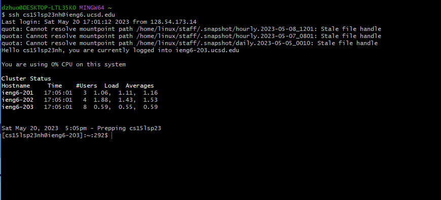
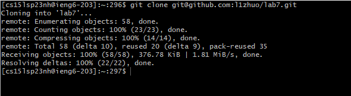
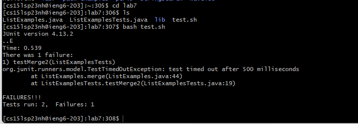
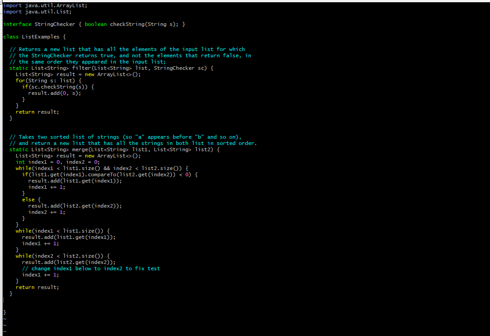
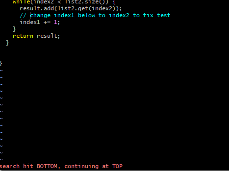
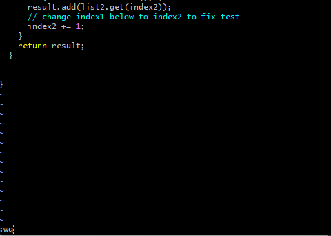
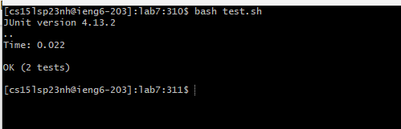
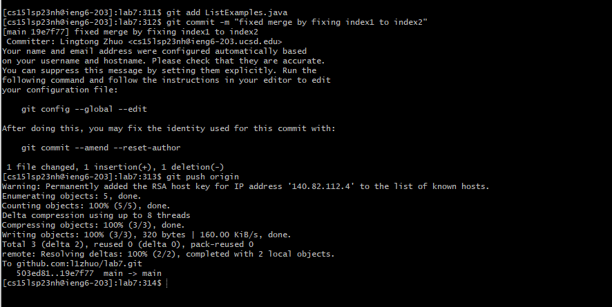

# **CSE15L Lab Report 4**

---

## Doing Everything from the Command Line

---

## Step 4 ##

Command Entered: `ssh cs15lsp23nh@ieng6.ucsd.edu <enter>` (remotely connect to my account at remote ieng6 server)

Did not enter password because saved my ssh key on the remote server.

---

## Step 5 ##

Command Entered: `git clone <Ctrl+Shift+V> (previous copied link git@github.com:l1zhuo/lab7.git) <enter>`

(clone my fork of lab7 repository using SSH key previously generated when working in the lab, pasted so I don't have to type the whole link)

---

## Step 6 ##

Command Entered:
1. `cd lab7 <enter>` 

(change the directory to the cloned repository or lab7 foler)

2. `bash test.sh <enter>` 

(pre-provided test files) (this was previously existed in the forked repository, so I used it to help me to run tests faster, it's essentially running the junit tests by executing both command `javac -cp .:lib/hamcrest-core-1.3.jar:lib/junit-4.13.2.jar *.java` and `java -cp .:lib/hamcrest-core-1.3.jar:lib/junit-4.13.2.jar org.junit.runner.JUnitCore ListExamplesTests`)

---

## Step 7 ##

Command Entered:
1. `vim ListExamples.java` 

(this opens `ListExamples.java` using Vim)

 

2. `/change<enter>` 

(this searches for the line that contains `/change` in the `ListExamples.java`, and put my cursor at the beginning of the keyword. This helps me to locate the problem faster without moving my cursor a whole lot in vim normal mode. I could've done this because `ListExamples.java` was previously written with a comment to indicate where to change, so this wouldn't be a go-to strategy if I didn't know where the probelm is)

3. `jer2<esc>:wq<enter>` 

(`j` moves my cursor 1 line done, puts me at the word `index1`, `e` moves my cursor to 1 character forward of the end of the word `index1`, `r` lets me replace one character behind my cursor and put me back to normal mode, and of course `2` replaces the character `1` to `2`. Then `<esc>` makes sure I am in the normal mode, `:wq<enter>` to finish off the editing, and save my edit and exit the file )

---

## Step 8 ##

Command Entered: `bash test.sh<enter>` (pre-provided test files)

(again, the command runs the pre-provided `bash` scripts and runs junit tests)

---

## Step 9 ##

Command Entered:
1. `git add ListExamples.java <enter>` 

(add `ListExamples.java` to files that will be changed in the backend which later will be committed)

2. `git commit -m "fixed merge by fixing index1 to index2" <enter>`

(commit the changes locally, replacing the file with the message after `-m` option, which is `"fixed merge by fixing index1 to index2" `)

3. `git push origin <enter>`

(push the changes to the remote file path, making the file change in the remote path)

